# Deployment and Setup Introduction
This document will provide guidelines to deploy and configure the Mojaloop applications on a local environment, utilizing Kubernetes within a Docker. If the deployment process is commpleted successfully, the Postman collection can be executed against that environment.

* [Software List](#software-list)
  * [Deployment Recommendations](#deployment-recommendations)
  * [Local Deployment and Testing Tools](#local-deployment-and-testing-tools)
* [Deployment](#deployment)
  * [Kubernetes](#kubernetes)
    * [Kubernetes Installation with Docker](#kubernetes-installation-with-docker)
    * [Kubernetes environment setup](#kubernetes-environment-setup)
  * [Helm](#helm)
    * [Helm Chart Installation](#helm-chart-installation)
  * [Postman](#postman)
    * [Postman Collection and Environment](#postman-collection-and-environment)

## Software List 
Before proceeding, please have a look at [Deployment Recommedations](#deployment-recommedations) to insure the minimum resource requirements are availlable.

### Deployment Recommendations
This provides environment resource recommendations with a view of the infrastructure architecture.
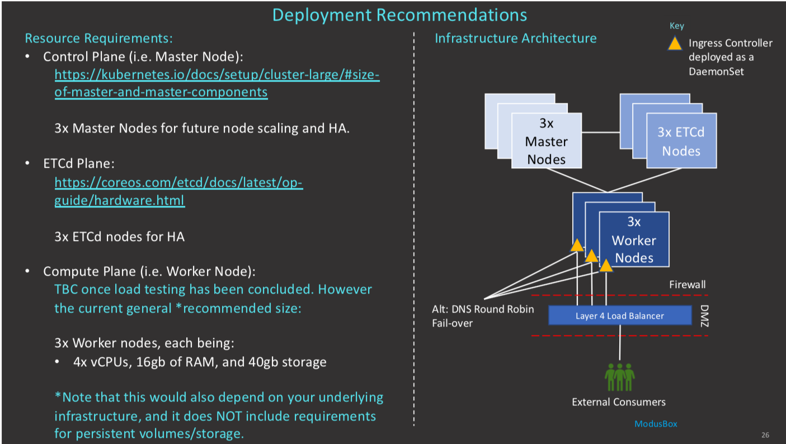

### Local Deployment and Testing Tools
The tool set to be deployed as part of the deployment process.

   |Tool|Required/Optional|Description|Install Info|
   |---|---|---|---|
   |Docker|Required|<ul><li>Docker Engine and CLI Client</li><li>Local Kubernetes single node cluster</li></ul>|<ul><li>[https://docs.docker.com/install](https://docs.docker.com/install)</li></ul>|
   |Kubectl|Required|<ul><li>Kubernetes CLI for Kubernetes Management</li><li>Note Docker installs this part of Kubernetes install</li></ul>|<ul><li>[https://kubernetes.io/doc/tasks/tools/install-kuberctl](https://kubernetes.io/doc/tasks/tools/install-kuberctl)</li><li>Docker Kubernetes Install (as per this guide)</li><li>Mac: brew install kubernetes-cli</li></ul>|
   |Kubectx|Optional(useful tool)|<ul><li>Kubernetes CLI for Kubernetes Context Management Helper</li><li>Note Docker insgtalls this as part of Kubernetes install</li></ul>|<ul><li>[https://github.com/ahmetb/kubectx](https://github.com/ahmetb/kubectx)</li><li>Mac: brew install kubectx</li></ul>|
   |Helm|Required|<ul><li>Helm helps you manage Kubernetes applications</li><li>Helm charts help you define, install and upgrade even the most complex Kubernetes application</li></ul>|<ul><li>[https://docs.helm.sh/using_helm/#installing-helm](https://docs.helm.sh/using_helm/#installing-helm)</li><li>Mac: brew install kubernetes-helm</li></ul>|
   |Postman|Required|<ul><li>Postman is a Google Chrome application for the interacting with HTTP API's. It presents you with a friendly GUI for the construction requests and reading responces.</li></ul>|<ul><li>[https://www.getpostman.com/apps](https://www.getpostman.com/apps)</li></ul>|

## Deployment
This section will guide the reader through the deployment process required for Kubernetes within Docker.

### Kubernetes
If you are new to Kubernetes it is strongly recommended to familiarize yourself with Kubernetes. [Kubernetes Concepts](https://kubernetes.io/docs/concepts/overview/) is a good place to start and provide an overview.

The following are Kubernetes concepts used within the project. An understanding of these concepts is imperative before attempting the deployment;
- Deployment
- Pod
- ReplicaSets
- Service
- Ingress
- StatefulSet
- DaemonSet
- Ingress Controller
- ConfigMap
- Secret

#### Kubernetes Installation with Docker
To install Kubernetes with Docker, follow the steps below;
 - Click on the Docker icon in the status barr
   - Select **Preferences**
   - Go to **Advanced**
     - Increase the CPU allocation to at least 4
     - Increase the Memory allocation to at least 8.0 GiB

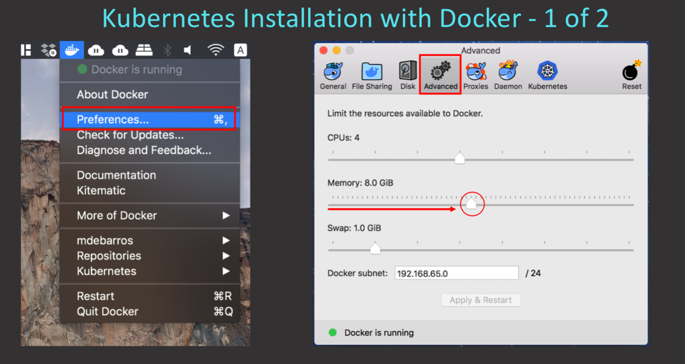
   - Go to **Kubernetes**
     - Select **Enable Kubernetes** tick box
     - Make sure **Kubernetes** is selected
     - Click **Apply**
     - Click **Install** on the confirmation tab. 
 - The option is available to wait for completion or run as a background task.

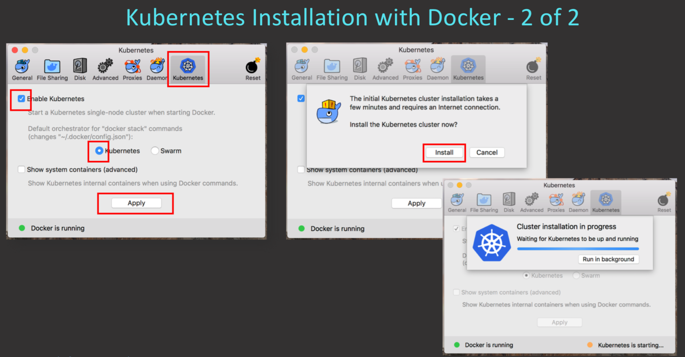

#### Kubernetes environment setup:
The following are all command line executables specifically for Mac. 
- List the current Kubernetes context;
   <ul><li><b>$ kubectl config get-contexts</b> or
   </li><li><b>$ kubectx</b></li></ul>
- Change your Contexts; 
    <ul><li><b>$ kubectl config use-contexts <docker-for-desktop></b> or
    </li><li><b>$ kubectx <docker-for-desktop></b></li></ul>
 
- Install Kubernetes Dashboard roles, services & deployment. (Alternative install for Dashboard using Helm: [kubernetes-dashboard](https://github.com/helm/charts/tree/master/stable/kubernetes-dashboard)) 
  - **IMPORTANT:**  Always verify current [kubernetes-dashboard](https://github.com/kubernetes/dashboard) yaml file for the below create command.
  <ul><li><b>$ kubectl create -f https://raw.githubusercontent.com/kubernetes/dashboard/v1.10.1/src/deploy/recommended/kubernetes-dashboard.yaml</b></li></ul>
- Verify Kubernetes Dashboard;
    <ul><li><b>$ kubectl get pod --namespace=kube-system |grep dashboard</b></li></ul>
- Start proxy for local UI in new terminal;
    <ul><li><b>$ kubectl proxy ui</b></li></ul>
 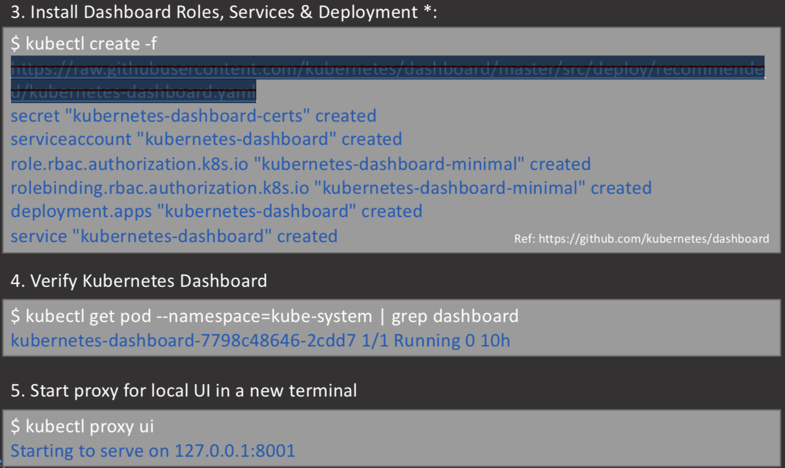
- Open URI in default browser
   <ul><li><b>http://localhost:8001/api/v1/namespaces/kube-system/services/https:kubernetes-dashboard:/proxy/#!/</b></li>
   <li>Select <b>Token</b>. Generate a token to use there by:</li>
   <li><b>$ kubectl -n kube-system get secrets | grep dashboard-token</b></li>
   <li><b>$ kubectl -n kube-system describe secrets/kubernetes-dashboard-token-btbwf</b> The <b>{kubernetes-dashboard-token-btbwf}</b> is retrieved from the output in the previous step</li>
   <li>The token to use is shown on the last line of the output of that command</li></ul>

   <li>For more information on generating the token, follow the <b>Authentication</b> link in the window.</li>
 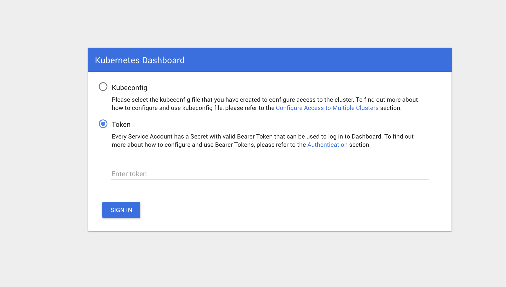
- Config Helm CLI and install Helm Tiller on K8s cluster
  <ul><b>$ helm init</b></ul>
- Validate Helm Tiller is up and running
  <ul><b>$ kubectl -n kube-system get po | grep tiller</b></ul>
 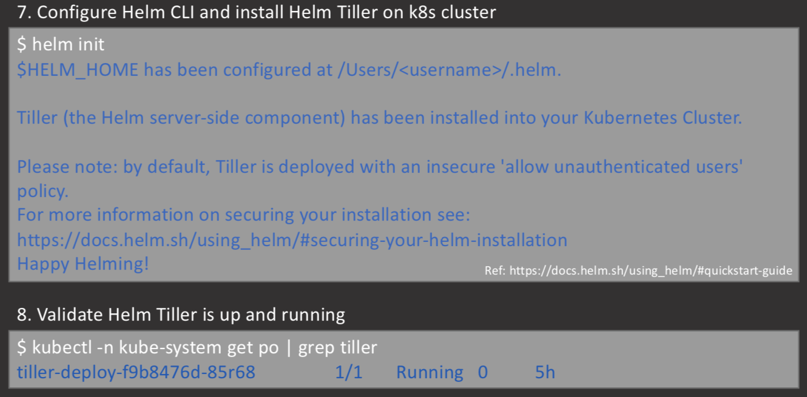	
- Add mojaloop repo to your Helm config (optional)
  <ul><b>$ helm repo add mojaloop http://mojaloop.io/helm/repo/</b></ul>
- Update helm repositories
  <ul><b>$ helm repro update</b></ul>
- Install nginx-ingress for load balancing & external access
  <ul><b>$ helm --namespace kube-public install stable/nginx-ingress</b></ul>
 		
- Add the following to your /ect/hosts
----  
    127.0.0.1       interop-switch.local central-kms.local forensic-logging-sidecar.local central-ledger.local central-end-user-registry.local central-directory.local central-hub.local central-settlements.local ml-api-adapter.local
----
- Test ml-api-adapter and central-ledger health in browser after installation
  - http://ml-api-adapter/health
  - http://central-ledger/health
  <ul><b>Note:</b></lu>
    If you get the following by testing "central-ledger/health"

        central-ledger’s server IP address could not be found.
        ERR_NAME_NOT_RESOLVED
        
        Verify that a helm chart(s) was installed by executing
        $ helm list
        
        If the helm charts are not listed, see the Helm Chart Installation section below.
  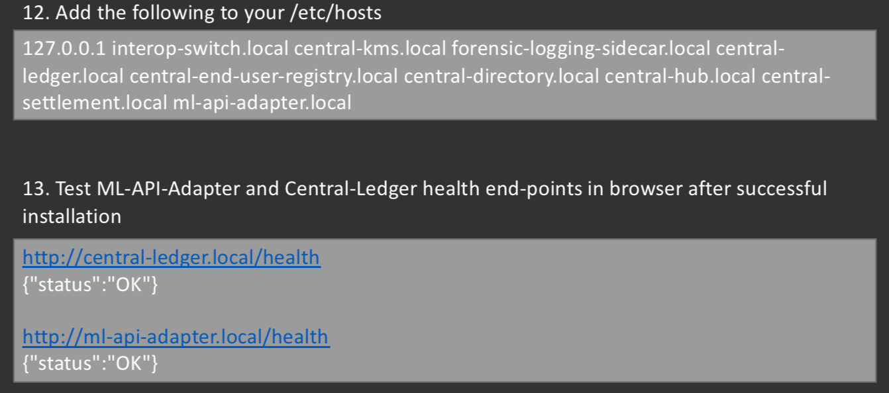

### Helm
Please review [Mojaloop Helm Chart](../Diagrams/MojaloopHelmChart.md) to understand the relationships between the deployed Mojaloop helm charts.

##### Helm Chart Installation
This section will provide guidelines to delete, list, install and upgrade of the helm charts. For a comprehensive deployment documentation, please see [Helm Chart Deployment](https://github.com/mojaloop/helm/blob/master/README.md)

- Lets start by **listing** the current helm charts deployed
  <ul><b>$ helm list</b></ul>
 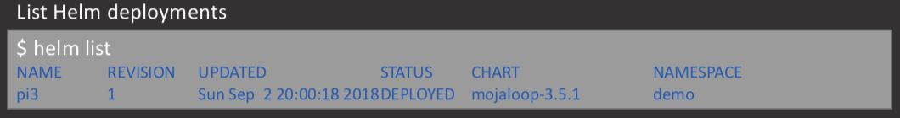

- If you would like to **delete** a deployed helm chart
  <ul><b>$ helm del --purge name</b></ul>
 		
	Delete helm deployments
		helm del --purge <name>
		
- To **install** Mojaloop chart(s)
  To install the full mojaloop project
  <ul><b>$ helm install --namespace=demo --name=pi3 mojaloop/mojaloop</b></ul>
 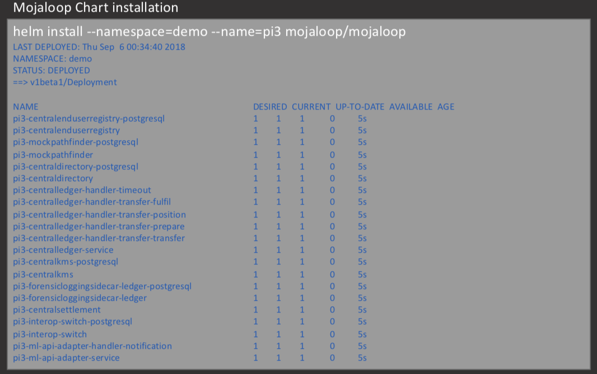
  <ul> Alternative directly from the repository: <b>$ helm install --namespace=demo --name=pi3 --repo=http://mojaloop.io/helm/repo mojaloop</b></ul>
  or install a specific mojaloop chart eg. Central-ledger
  <ul><b>$ helm install --namespace=demo --name=pi3 mojaloop/centralledger</b></ul>

 
  <ul> Alternative directly from the repository: <b>$ helm install --namespace=demo --name=pi3 --repo=http://mojaloop.io/helm/repo centralledger</b></ul> 

- To upgrade Mojaloop chart(s)
  <ul><b>$ helm upgrade pi3 --set central.centralledger.centralledger-services.containers.api.image.tag=v3.5.0-snapshot mojaloop</b></ul>
 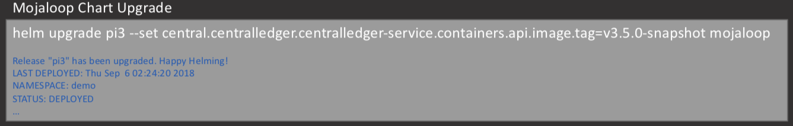
- To upgrade a specific chart eg. Central-ledger	     
  <ul><b>$ helm upgrade pi3 --set centralledger-services.containers.api.image.tag=v3.5.0-snapshot mojaloop/centralledger</b></ul>
 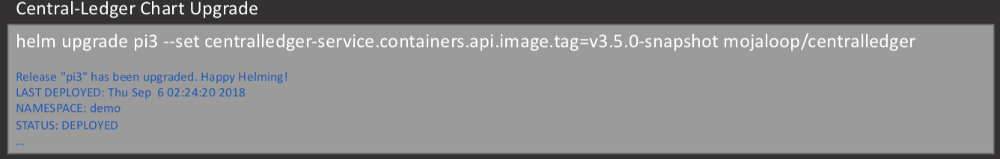
### Postman
##### Postman Collection and Environment

Please visit [Postman](https://github.com/mojaloop/postman) and follow the README.md guide to setup Postman collection and environment. 
 - Environment to use;
   - MojaloopLocalK8sonDocker.postman_environment.json
 - The current collection(s) to import are;
   - OSS-New-Deployment-FSP-Setup.postman_collection.json
   - OSS-API-Tests.postman_collection.json
   - OSS-Feature-Tests.postman_collection.json
